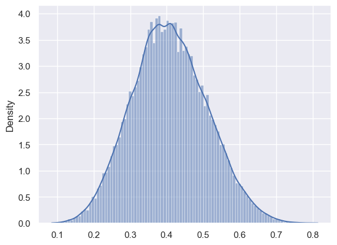
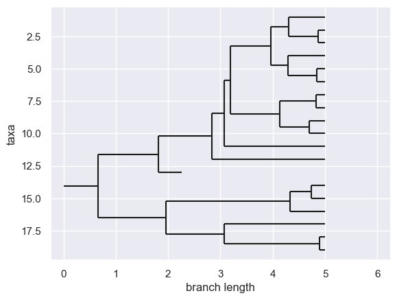
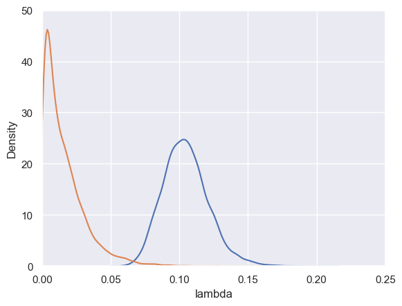

# Jupyter interface

## Introduction

In a Jupyter notebook, import the TreePPL package and load its extension for Jupyter. This extension provides an easy-to-use interface for working with TreePPL directly within Jupyter notebooks:

```python
import treeppl
%load_ext treeppl.ipython
```

Once the extension is loaded, you can use the `%%treeppl` cell magic to write and compile a TreePPL program. Executing the cell creates a `treeppl.Model` object, which allows interaction with the compiled program directly in Python. This object is stored in a Python variable specified as an argument to the `%%treeppl` magic (i.e., immediately following `%%treeppl` on the first line). Optionally, the variable name can be followed by parameters and values. Examples are provided below.

<!-- The extension also supports basic syntax highlighting for TreePPL programs. -->

The following cell demonstrates a simple TreePPL program for simulating the flip of a fair coin:

```python
%%treeppl flip samples=10

model function flip() => Bool {
  assume p ~ Bernoulli(0.5);
  return p;
}
```

In this example, a `treeppl.Model` instance is created, and the program is compiled. The name `flip` (specified after `%%treeppl`) provides an interface for interacting with the model. The argument `samples=10` specifies the number of samples to collect when the program is executed.

To run the TreePPL program, simply call the variable as a function (e.g., `flip()`). This executes the program and returns a `treeppl.InferenceResult` object, which includes a `samples` attribute containing the generated samples. While samples may have different weights in more complex programs, they are equally weighted in this simple example. We will cover programs with weighted samples later.

Here’s an example of how to use the compiled program:

```python
res = flip()
res.samples
```
```
[True, False, True, False, False, False, False, False, True, True]
```

## Examples from the paper

```python
import numpy as np
import pandas as pd
import matplotlib.pyplot as plt
import seaborn as sns
from IPython.display import clear_output
from Bio import Phylo

sns.set_theme()
```

### Unfair coin

```python
%%treeppl coin samples=100000

model function coin(outcomes: Bool[]) => Real {
  assume p ~ Uniform(0.0, 1.0);
  for i in 1 to (length(outcomes)) {
    observe outcomes[i] ~ Bernoulli(p);
  }
  return p;
}
```

```python
res = coin(
    outcomes=[
        True, True, True, False, True, False, False, True, True, False,
        False, False, True, False, True, False, False, False, False, False,
    ]
)
sns.histplot(
    x=res.samples, weights=res.nweights, bins=100, stat="density", kde=True
)
```




## Generating a CRBD tree

```python
%%treeppl generative_crbd samples=1

model function generativeCrbd(time: Real, lambda: Real, mu: Real) => Tree {
  assume waitingTime ~ Exponential(lambda + mu);
  let eventTime = time - waitingTime;
  if eventTime < 0.0 {
    return Leaf {age = 0.0};
  } else {
    assume isSpeciation ~ Bernoulli(lambda / (lambda + mu));
    if isSpeciation {
      return Node {
        left = generativeCrbd(eventTime, lambda, mu),
        right = generativeCrbd(eventTime, lambda, mu),
        age = eventTime
      };
    } else {
      return Leaf {age = eventTime};
    }
  }
}
```

```python

params = {
    "time": 5.0,
    "lambda": 1.0,
    "mu": 0.1
}

result = generative_crbd(**params)
tree = result.samples[0]
tree = Phylo.BaseTree.Clade(
    branch_length=params["time"] - tree.age,
    clades=[tree.to_biopython()]
)
Phylo.draw(tree)
```



### Inferring parameters of a CRBD model

```python
%%treeppl crbd samples=10000 subsamples=10

function simulateExtinctSubtree(time: Real, lambda: Real, mu: Real) {
  assume waitingTime ~ Exponential(lambda + mu);
  if waitingTime > time {
    weight 0.0; resample;
  } else {
    assume isSpeciation ~ Bernoulli(lambda / (lambda + mu));
    if isSpeciation {
      simulateExtinctSubtree(time - waitingTime, lambda, mu);
      simulateExtinctSubtree(time - waitingTime, lambda, mu);
    }
  }
}

function simulateUnobservedSpeciations(node: Tree, time: Real, lambda: Real, mu: Real) {
  assume waitingTime ~ Exponential(lambda);
  if time - waitingTime > node.age {
    simulateExtinctSubtree(time - waitingTime, lambda, mu);
    weight 2.0;
    simulateUnobservedSpeciations(node, time - waitingTime, lambda, mu);
  }
}

function walk(node: Tree, time:Real, lambda: Real, mu: Real) {
  simulateUnobservedSpeciations(node, time, lambda, mu);
  observe 0 ~ Poisson(mu * (time - node.age));
  if node is Node {
    observe 0.0 ~ Exponential(lambda);
    walk(node.left, node.age, lambda, mu);
    walk(node.right, node.age, lambda, mu);
  }
}

model function crbd(tree: Tree) => Real[] {
  assume lambda ~ Gamma(1.0, 1.0);
  assume mu ~ Gamma(1.0, 0.5);
  walk(tree.left, tree.age, lambda, mu);
  walk(tree.right, tree.age, lambda, mu);
  return [lambda, mu];
}
```

```python
alcedinidae = treeppl.Tree.load("trees/Alcedinidae.phyjson", format="phyjson")

samples = None
for i in range(1000):
    try:
        res = crbd(tree=alcedinidae)
        samples = pd.concat([
            samples,
            pd.DataFrame({
                "lambda": res.items(0), "mu": res.items(1), "lweight": res.norm_const
            })
        ])
        weights = np.exp(samples.lweight - samples.lweight.max())
        clear_output(wait=True)
        sns.kdeplot(data=samples, x="lambda", weights=weights)
        sns.kdeplot(data=samples, x="mu", weights=weights)
        plt.xlim(0, 0.25)
        plt.ylim(0, 50)
        plt.pause(0.05)
    except KeyboardInterrupt:
        break
```


