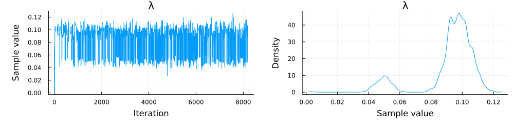

import Tabs from '@theme/Tabs';
import TabItem from '@theme/TabItem';

## Introduction
In this tutorial we will demonstrate how to use the Julia package [Pigeons.jl](https://pigeons.run/stable/) use parallel tempering to parallelize and improve MCMC inference in TreePPL.
Parallel tempering is particularly powerful for combinatorial, multimodal and overparametrized posteriors, which abound in statistical phylogenetics.

We will use the constant rate birth death (CRBD) model as the running example.

### What is parallel tempering and Pigeons?
MCMC algorithms are inherently sequential algorithms, since the next iteration depends explicitly on what we are computing in the current.
This makes it difficult to harness parallel hardware in modern high performance computers to speed up MCMC inference.
Parallel tempering offers one solution to this problem by executing several communicating MCMC chains in parallel.
All except one chain are _heated_ (tempered) which has the effect of flattening the likelihood landscape of the model and making it easier for the MCMC algorithm to move to new regions of parameter space.
The last chain is _cold_ and corresponds to the true model, and it is from this chain one reads samples.
To allow the cold chain to utilize the explorations of the hot chains, the chains swap parameter states every once in a while.

[Pigeons.jl](https://pigeons.run/stable/) is a Julia package for sampling from difficult posterior distributions.
Along with other algorithms for achieving this task, it implements a state-of-the-art variant of parallel tempering called _non-reversible parallel tempering_ that uses an efficient communication scheme and adaptively sets the heating schedule.
It is this algorithm that we can access with TreePPL models and that we will try out in this tutorial.
With Pigeons it is possible to run parallel tempering both on several cores on the same computer and across several machines on an HPC cluster, for more details on the latter see the [Pigeons documentation on MPI usage](https://pigeons.run/stable/mpi/).
Compared to classical variants of parallel tempering, Pigeon's performance does not deteriorate as the number of chains grows large.

## Running TreePPL models with Pigeons

### Installing Pigeons
To proceed in this tutorial we will assume that you have the programming language [Julia](https://julialang.org/) installed on your machine.
The latest version of Pigeons, along with some other packages used in this tutorial, can then be installed by starting the Julia REPL and running
```julia
import Pkg;
Pkg.install("Pigeons")
```

If you want to plot the samples immediately in Julia you can also install the [MCMCChains](https://turinglang.org/MCMCChains.jl/stable/) and [StatsPlots](https://docs.juliaplots.org/dev/generated/statsplots/) packages, run
```julia
Pkg.install("StatsPlots", "MCMCChains")
```

### Compiling and running the CRBD model

We first set up the paths to the TreePPL source code for the host repertoire model.
Here we assumed that the [TreePPL repository](https:/github.com/treeppl/treeppl) is available at `./treeppl` in your working directory, please substitute this with the correct path on your machine.
```julia
# Path to the TreePPL repository
treeppl_path = "./treeppl"
# Path to the subdirectory containing the host repertorie model
model_dir = "$treeppl_path/models/diversification"
# The variant of the host reperotire model we want to execute
model_name = "crbd"

# Path to the host repertoire model
model_path = "$(model_dir)/$(model_name).tppl"
# Where to write the compiled binary
bin_path = "$(model_dir)/data/$(model_name).out"
# Path to some example data to run posterior inference on
data_path = "$(model_dir)/data/testdata_$(model_name).json"
# Path to the directory where the samples will be written
output_path = "pigeons_output_dir"
```

Next we want to compile the host repertoire model and create a `TreePPLTarget` struct.
This object is later passed to the Pigeons parallel tempering algorithm and contains necessary information about the distribution you are sampling from.
For more information, try typing `?TreePPLTarget` in the Julia REPL.
To compile the model, Pigeons also needs to have access to the TreePPL compiler; here we assume that it is available as `tpplc` in your `PATH`.

```julia
using Pigeons

# Compile the host repertoire model
tppl_bin = Pigeons.tppl_compile_model(
    model_path, bin_path;
    local_exploration_steps=10, # The number of MCMC moves to perform in TreePPL before swapping temperatures
    sampling_period=10          # How often we should record the samples
)

# Construct the TreePPLTarget
tppl_target = Pigeons.tppl_construct_target(tppl_bin, data_path, output_path)
```

With the TreePPL target ready, we are ready to launch Pigeons!
The number of rounds determines how many iterations to run: each round successive round double the number of iterations in the previous round
```julia
pt = pigeons(target = tppl_target, n_rounds = 12, n_chains = 10, multithreaded=true)
Pigeons.kill_child_processes(pt) # Kill the TreePPL processes after we are done
```

```terminal
┌ Info: Neither traces, disk, nor online recorders included.
│    You may not have access to your samples (unless you are using a custom recorder, or maybe you just want log(Z)).
└    To add recorders, use e.g. pigeons(target = ..., record = [traces; record_default()])
────────────────────────────────────────────────────────────────────────────
  scans        Λ        time(s)    allc(B)  log(Z₁/Z₀)   min(α)     mean(α) 
────────── ────────── ────────── ────────── ────────── ────────── ──────────
        2       3.99     0.0606   4.66e+06       -855   1.76e-21      0.557 
        4       4.88     0.0231   8.17e+06       -381   0.000169      0.458 
        8       6.03     0.0672   1.63e+07       -326    0.00777       0.33 
       16        5.7      0.116   3.27e+07       -299   2.83e-05      0.367 
       32       6.37      0.229   6.53e+07       -317   8.06e-07      0.292 
       64       6.44      0.413   1.31e+08       -310    0.00024      0.285 
      128       6.57      0.872   2.61e+08       -310     0.0021       0.27 
      256          7       1.66   5.22e+08       -310     0.0483      0.222 
      512       6.99       3.36   1.04e+09       -312     0.0961      0.223 
 1.02e+03       6.91       6.95   2.09e+09       -309     0.0902      0.232 
 2.05e+03       6.79       13.7   4.18e+09       -306     0.0618      0.246 
  4.1e+03       6.79       26.8   8.35e+09       -303     0.0766      0.246 
────────────────────────────────────────────────────────────────────────────
```

The output above gives some other useful information such as an estimate of the normalization constant of the prior distribution compared to the posterior.
We of course also want to look at the samples from the cold chain, to do this we first need to compile the samples which are spread across several files into one file 
```julia
Pigeons.tppl_compile_samples(pt, "compiled_samples.json")
```
We could then analyze the samples using `treeppl-python` or `treepplr`. 
However, the CRBD model has very simple outputs – a single Float representing the birth rate parameter – so we will also show a quick and dirty trace and density plot directly in Julia.
```julia
using MCMCChains, StatsPlots
# Read the compiled samples file
samples = [parse(Float64, x) for x in readlines("compiled_samples.json")]
# Construct and Chains object from MCMCChains.jl 
ch = Chains(samples, [:λ])
# Plot the samples! 
plot(ch)
```


## Further reading 

Documentation for the various functions used from [Pigeons.jl](https://pigeons.run/stable/) package is available in the [Pigeons API reference](https://pigeons.run/stable/reference/).
Note that it is also possible (and convenient) to access package documentation directly in the Julia REPL by first typing `?` and then the name of the thing you are interested in learning about, e.g. `?Pigeons.tppl_compile_model` to learn what options are available when compiling a model with Pigeons.

Please browse Pigeon's documentation further to learn more about how to interpret and configure the output from Pigeons.
Have a look in particular at the [documentation on using MPI](https://pigeons.run/stable/mpi/) if you are interested in running Pigeons in a distributed fashion.

## References
Please make sure to acknowledge the awesome work of the Pigeon's team by citing their paper if you use Pigeons in your work.

Surjanovic, N., Biron-Lattes, M., Tiede, P., Syed, S., Campbell, T., & Bouchard-Côté, A. (2023). Pigeons.jl: Distributed sampling from intractable distributions. [_arXiv:2308.09769_](https://arxiv.org/abs/2308.09769).